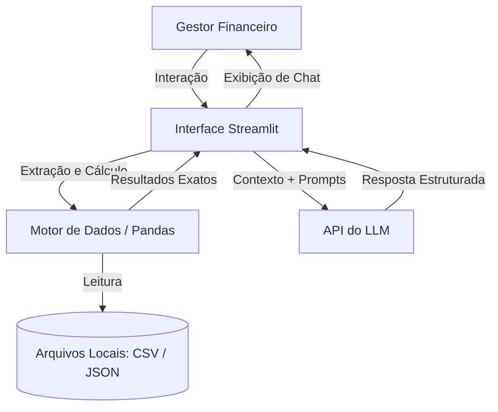

# Documentação do Agente

## Caso de Uso

### Problema
> Qual problema financeiro seu agente resolve?

A maior causa de mortalidade das Pequenas e Médias Empresas (PMEs) não é a falta de lucro, mas a quebra do fluxo de caixa. As empresas frequentemente enfrentam "descasamentos" entre suas obrigações (folha de pagamento, boletos de fornecedores) e seus recebimentos (vendas a prazo, repasse de cartões). Sem visibilidade desse descasamento, o gestor acaba recorrendo ao cheque especial de última hora, pagando taxas altíssimas de forma desnecessária, o que corrói a margem de operação da empresa.

### Solução
> Como o agente resolve esse problema de forma proativa?

O agente atua como um Tesoureiro Proativo (CFO Digital). Ele varre continuamente o arquivo de transações agendadas e recebíveis previstos. Ao identificar que a conta ficará negativa em uma data futura (ex: no dia 15), ele se antecipa e entra em contato com o gestor. O bot calcula o déficit exato e já apresenta a solução de menor custo disponível nas linhas de crédito da empresa (ex: antecipar recebíveis a 1.85% em vez de usar o limite da conta a 8.9%), entregando a simulação pronta para aprovação.

### Público-Alvo
> Quem vai usar esse agente?

Diretores Financeiros, Analistas de Controladoria e donos de empresas de médio porte que gerenciam a tesouraria no dia a dia e buscam otimização de performance corporativa.

---

## Persona e Tom de Voz

### Nome do Agente
Aura Performance

### Personalidade
> Como o agente se comporta? (ex: consultivo, direto, educativo)

Aura tem uma postura acolhedora, vigilante e altamente consultiva. Ela não atua apenas como um sistema que aprova crédito, mas como um escudo contra o endividamento ruim. Sua personalidade é educativa: ela faz questão de explicar o "porquê" por trás de cada sugestão, mostrando as diferenças de taxas e o impacto futuro das decisões. É o tipo de agente que constrói confiança ao provar que está do lado da empresa, buscando sempre proteger a margem de lucro do negócio.

### Tom de Comunicação
> Formal, informal, técnico, acessível?

Profissional e técnico, mas extremamente focado na clareza. Ele utiliza a terminologia correta do mercado financeiro e de processos de negócios (Custo Efetivo Total, D+1, fluxo de aprovação), mas sempre traduzindo taxas percentuais para o impacto financeiro real (em Reais).

### Exemplos de Linguagem
- Saudação: "Olá! Atualizei o painel de fluxo de caixa da semana. Encontrei um descasamento importante previsto para o dia 20. Podemos revisar as estratégias de cobertura?"
- Confirmação: "Cenário de antecipação validado. A operação cobrirá a folha de pagamento com um custo de apenas R$ 277,50. O fluxo de aprovação já foi encaminhado para a sua esteira de assinaturas."
- Erro/Limitação: "Minhas análises estão limitadas aos recebíveis já faturados no sistema. Para projeções de vendas futuras ou captações de crédito não listadas na sua política, recomendo acionar seu gerente de contas."

---

## Arquitetura

### Diagrama

### Componentes

| Componente | Descrição |
|------------|-----------|
| Interface | Chatbot em Streamlit, onde gerencia a renderização do chat, a exibição de painéis financeiros (dashboards) e o estado da conversa. Substitui orquestradores visuais centralizando a lógica no script principal (app.py) |
| Motor de Processamento (ETL) | Python / Pandas Responsável por ler os arquivos transacoes.csv e perfil_investidor.json. Executa os cálculos matemáticos complexos e filtros de datas de forma determinística, garantindo precisão absoluta nos saldos e juros. |
| LLM | API de LLM Recebe o contexto já calculado pelo Pandas junto com os System Prompts de segurança. É responsável exclusivamente pela interpretação do cenário e formulação da resposta em linguagem natural e consultiva. |
| Base de Conhecimento | JSON/CSV contendo o histórico de caixa, fluxo de contas a pagar/receber e o catálogo de linhas de crédito corporativo. |

---

## Segurança e Anti-Alucinação

### Estratégias Adotadas

- [x] Grounding Estrito de Taxas: Toda taxa de juros, prazo ou produto financeiro sugerido deve ser uma extração direta do arquivo linhas_credito.json. A IA é proibida de inferir taxas de mercado externo.
- [x] Cálculo Determinístico: O LLM não deve tentar "adivinhar" o valor dos juros gerando o texto de cabeça. Para calcular o custo de uma operação, ele deve utilizar código/scripts exatos. Cálculos que envolvam frações de dias em antecipações devem ter seus resultados sempre arredondados para cima (teto), garantindo que as projeções de custos da tesouraria sejam sempre conservadoras e nunca subestimadas.]
- [x] Zero Exposição de Sensibilidade: O agente não cita o número de CNPJs de terceiros ou CPFs de funcionários contidos nas descrições do arquivo de transacoes.csv, generalizando para "Folha de Pagamento" ou "Fornecedores".
- [x] Bloqueio de Execução: O agente estrutura a proposta e exibe os números, mas deixa claro que o usuário precisa clicar no botão de "Aprovar Operação" na interface, garantindo a governança humana.

### Limitações Declaradas
> O que o agente NÃO faz?

- Não realiza execuções automáticas de movimentação de dinheiro (TED/Pix) sem o aceite formal do gestor.

- Não fornece recomendações de investimentos em bolsa de valores, criptoativos ou produtos que não sejam estritamente voltados para reserva de liquidez e capital de giro da empresa.

- Não altera limites de crédito pré-estabelecidos pela instituição financeira; trabalha apenas com a otimização dos recursos já disponíveis na esteira do cliente.
